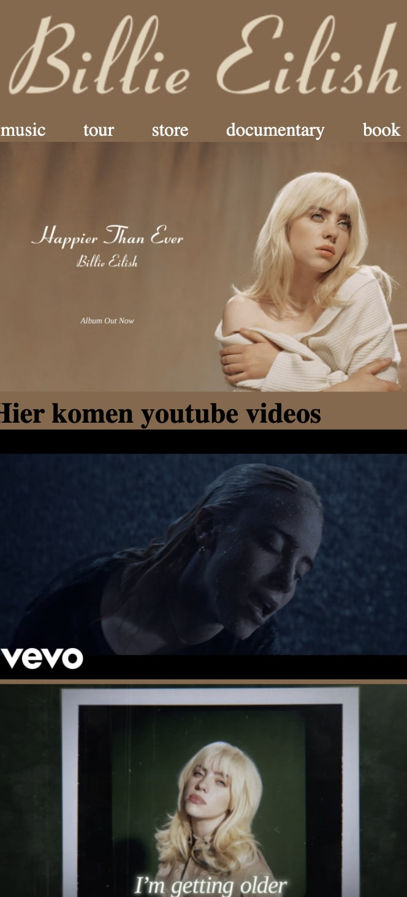

# Procesverslag
Markdown is een simpele manier om HTML te schrijven.  
Markdown cheat cheet: [Hulp bij het schrijven van Markdown](https://github.com/adam-p/markdown-here/wiki/Markdown-Cheatsheet).

Nb. De standaardstructuur en de spartaanse opmaak van de README.md zijn helemaal prima. Het gaat om de inhoud van je procesverslag. Besteedt de tijd voor pracht en praal aan je website.

Nb. Door *open* toe te voegen aan een *details* element kun je deze standaard open zetten. Fijn om dat steeds voor de relevante stuk(ken) te doen.

## Jij

uitwerken voor kick-off werkgroep

### Auteur:
Deon Blok

#### Je startniveau:
Blauw

#### Je focus:
Responsive
 

## Je website

uitwerken voor kick-off werkgroep

### Je opdracht:
https://www.billieeilish.com/

#### Screenshot(s) van de eerste pagina (small screen): 
Homepage  

#### Screenshot(s) van de tweede pagina (small screen):
Book

 

## Breakdownschets (week 1)

uitwerken na afloop 2e werkgroep

### de hele pagina: 

### dynamisch deel (bijv menu): 

## Voortgang 1 (week 2)

uitwerken voor 1e voortgang

### Stand van zaken
hier dit ging goed & dit was lastig (neem ook screenshots op van delen van je website en code)

### Verslag van meeting
hier na afloop snel de uitkomsten van de meeting vastleggen

- padding: .5em verwijderen
- top:0 toevoegen voor de nav
- Goed de bronnen noteren
- achter een font ook de webfonts plaatsen
- max height/width ipv height/width.
- tip! voor kleine stukken een span gebruiken ipv een div.

## Voortgang 2 (week 3)

uitwerken voor 2e voortgang

### Stand van zaken
Deze week ging opzich best oke! Ik had veel tijd in mijn nav gestoken en geoefend met de opdrachten. Ik vond het maken van de nav wel heel erg lastig
ik heb daarom ook goed gebrukk gemaakt van de codepen. Ik moet ook zorgen dat ik bij blijf zodat ik op het einde niet in de problem ga komen.

### Verslag van meeting
hier na afloop snel de uitkomsten van de meeting vastleggen

- html commenten
- beginnen aan tweede pagina
- lekker zo doorgaan!

## Toegankelijkheidstest (week 4)

uitwerken na test in 8e voortgang

### Bevindingen
Lijst met je bevindingen die in de test naar voren kwamen:

#### Rode tekst
In de lijst van tourdata zijn de tickets uitverkocht. De tekst is rood. De rode tekst is niet tot nauwelijks te lezen met een oogafwijking. 
Dit los ik op door de rode kleur te vervangen met een donker gele kleur  waardoor het niet meer vel is in vergelijking met de achtergrond.

#### De beige tint is vaag
Ik heb voor bepaalde teksten een beige kleur, deze is niet duidelijk te lezen op de achtergrond kleur voor iemand met een oogafwijking.(met indien nodig een afbeelding)
Dit heb ik op gelost dor de beige kleur iets donkerder te maken en zo het contrast te verbeteren.(met indien nodig een afbeelding)

#### Imgage niet gezien 
Tijdens de VoiceOver op mijn site ontdekte ik dat de image in mijn nav overgeslagen werd. Vervolgens toen ik de toegankelijkheid ging testen door middel van de tab toets head ik precies hetzelfde, de image in de nav werd overgeslagen. Ditga ik oplossen door een button ervan te maken. Zo kan hij wel gezien worden.

## Voortgang 3 (week 4)

uitwerken voor 3e voortgang

### Stand van zaken
Ik had deze week lekker doorgewerkt aan de site. Ik ben ook al begonnen aan de tweede pagina. Ik vind de site netjes maken nog er lastig, ook werkt mijn nav menu niet helemaal correct, hier moet ik aankomende dagen nog hard aan werken.(neem ook screenshots op van delen van je website en code)

### Agenda voor meeting
samen met je groepje opstellen

| student 1      | student 2          | student 3    | student 4        |
| ---            | ---                | ---          | ---              |
| dit bespreken  | en dit             | en ik dit    | en dan ik dat    |
| en dat ook nog | dit als er tijd is | nog een punt | dit wil ik zeker |
| ...            | ...                | ...          | ...              |

### Verslag van meeting
hier na afloop snel de uitkomsten van de meeting vastleggen

- Css nog netter maken
- Er mogen meer comments in de html gebruikt worden
- Indien extra tijd werken aan de banner afbeelding.

## Eindgesprek (week 5)

uitwerken voor eindgesprek

### Stand van zaken
De laatste dagen vond ik erg lastig, ik wilde nog van alles aanpassen en veel dinbgen zaten tegen. Ook had ik nog een andere deadline waardoor ik enorm veel stress kreeg. Uiteindelijk na heel veel moeite en tijd is het mij toch gelukt. Zie hieronder het resultaat.

### Screenshot(s)

## Bronnenlijst

continu bijhouden terwijl je werkt

Nb. Wees specifiek ('css-tricks' als bron is bijv. niet specifiek genoeg).

1. https://html-online.com/articles/image-align-center/ gebruikt voor het centreren van de img van de tour.
2. https://css-tricks.com/examples/nth-child-tester/ gebruikt voor de nth om te kijken hoe dit precies werkte. 
3.  https://developer.mozilla.org/en-US/docs/Web/CSS/CSS_Flexible_Box_Layout/Mastering_Wrapping_of_Flex_Items  Voor de grid-template-columns om de a netjes te krijgen voor mijn tweede pagina.
4. https://stackoverflow.com/questions/53846582/can-i-use-css-variables-in-a-font-list-and-have-it-work-in-legacy-browsers gebruikt voor css variable + font.
5. https://codepen.io/shooft/pen/zYzEPgv voor het maken van de responsive hamburger nav.
6. https://fonts.cdnfonts.com/css/coronet Dit is een font dat ik heb gebruikt.
7. https://fonts.cdnfonts.com/css/abhaya-libre-2 Dit is een font dat ik heb gebruikt.
8. https://css-tricks.com/snippets/css/complete-guide-grid/ voor het bekijken van alle mogelijkheden met grid
9. https://css-tricks.com/almanac/properties/ als ik bepaalde onderdelen in de css niet meer wist gebruikte ik dit.

